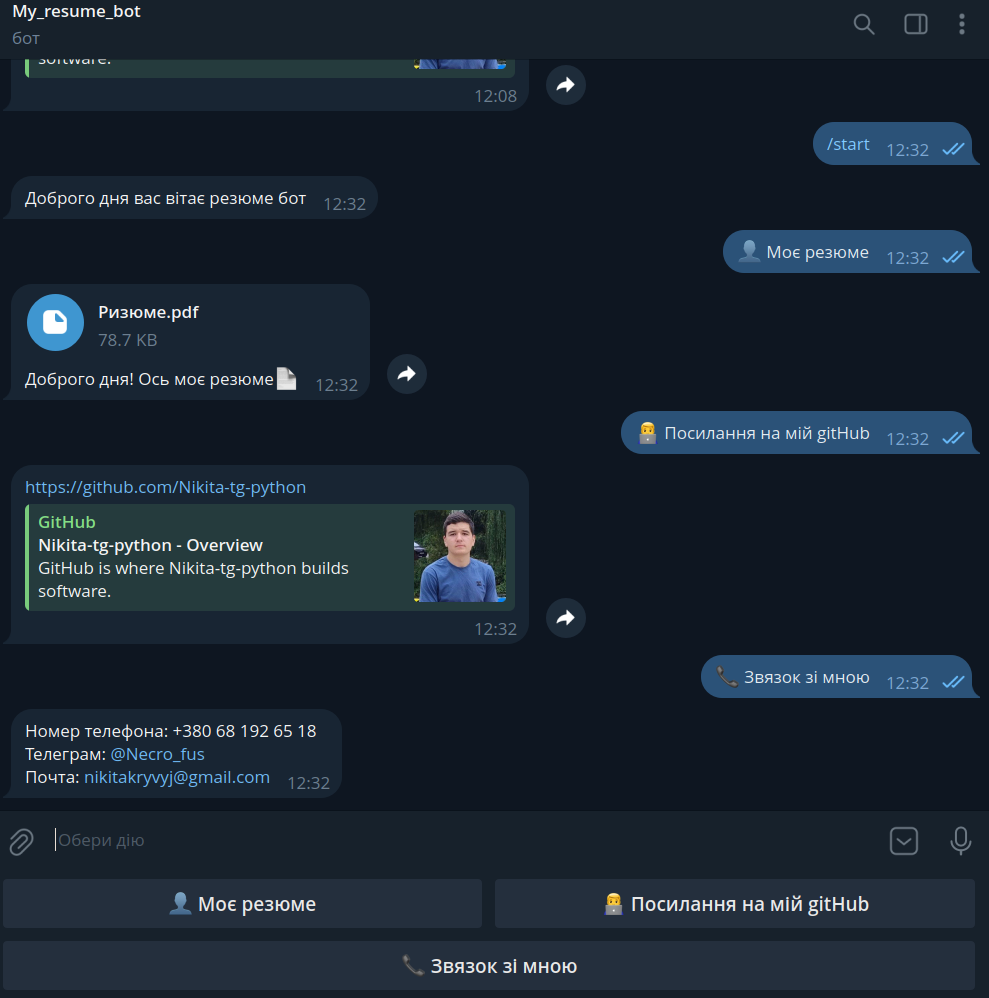

Interactive Resume Telegram Bot
Цей проєкт — мій персональний бот-резюме, створений на Python для автоматизації взаємодії з потенційними замовниками та рекрутерами.

Основні функції
Інтерактивне меню: Зручна навігація за допомогою кнопок.

Доставка резюме: Можливість миттєво завантажити моє актуальне резюме у форматі PDF.

Про мене: Коротка інформація про мої навички, стек технологій та проєкти.

Стабільність 24/7: Бот розгорнутий у хмарі (Render) та підтримується онлайн за допомогою систем моніторингу.

Стек технологій
Мова: Python 3.x.

Бібліотека: Aiogram.

Хостинг: Render (Web Service).

Фото роботи самого бота

Як запустити локально

Клонувати репозиторій:
git clone https://github.com/Nikita-tg-python/my_tg_bots.git

Встановити залежності:
pip install -r requirements.txt

Налаштувати змінні оточення:
Створіть файл .env та додайте свій токен:

Фрагмент коду
BOT_TOKEN=твій_токен_від_botfather

Запустити бота:
python tg_bot2.py

👨‍💻 Автор
Микита — Python Developer з Одеської області.

Профілі на фриланс-платформах:

[Freelance.ua](https://freelance.ua/ru/user/nikitakryvyj/)

[Freelancehunt](https://freelancehunt.com/freelancer/Nikita_Kriviy.html)
